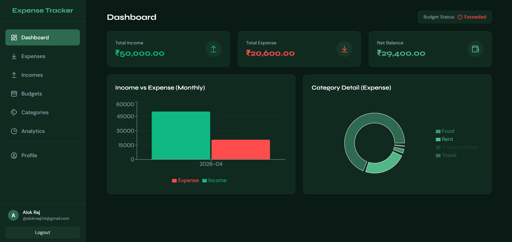
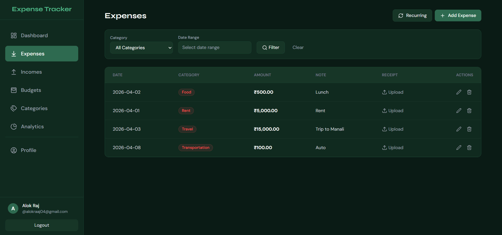
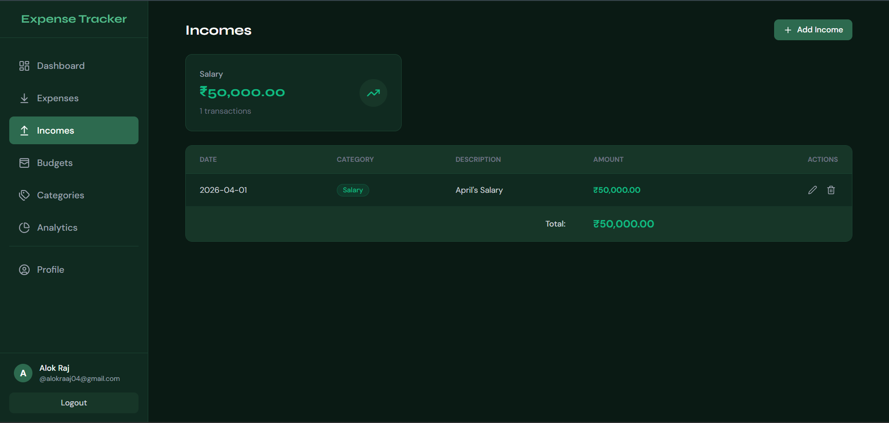
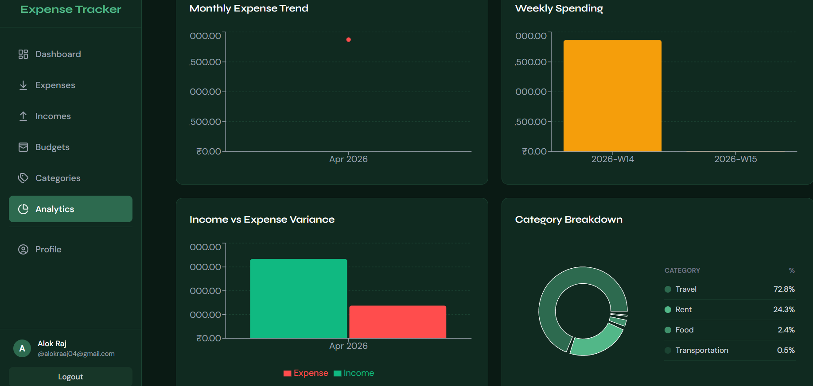
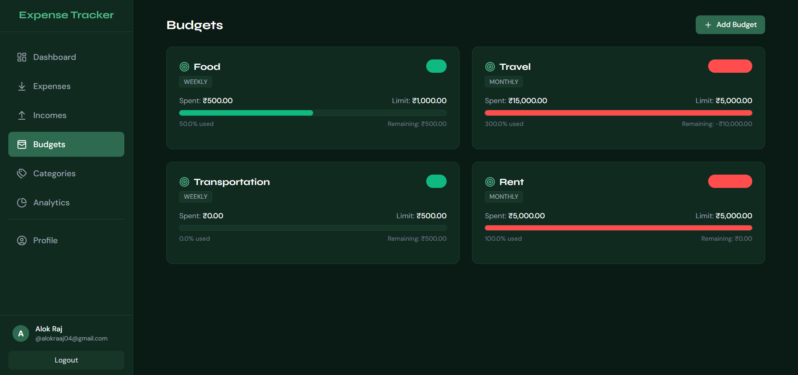
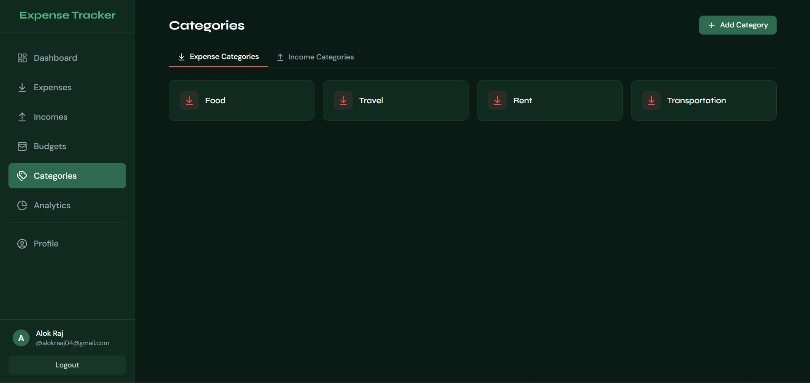
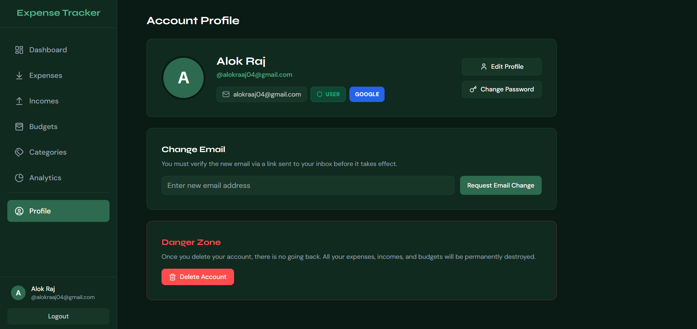
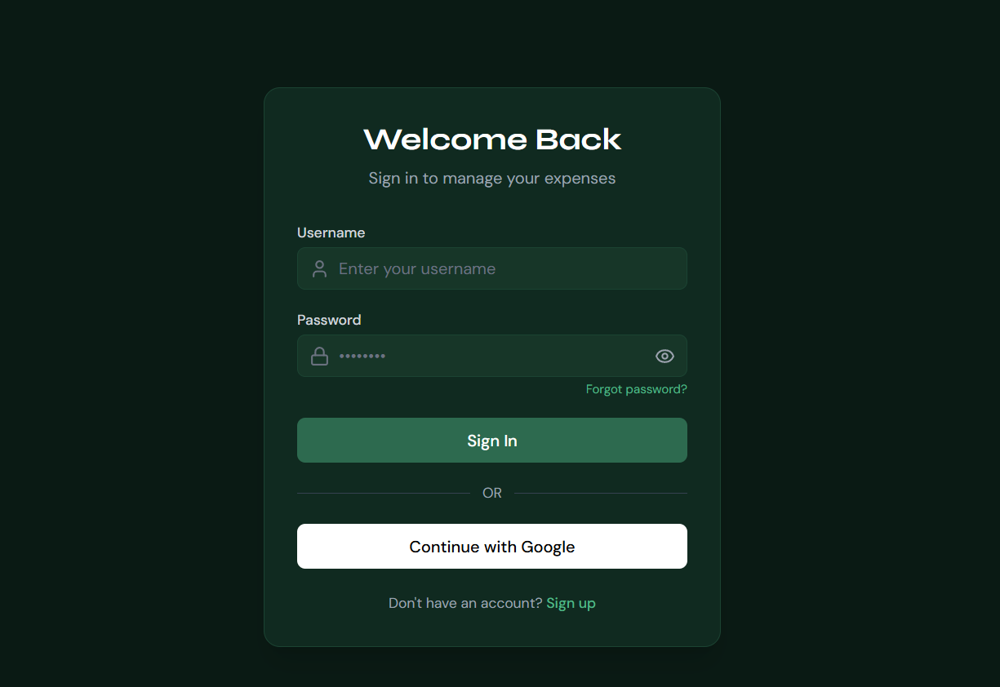
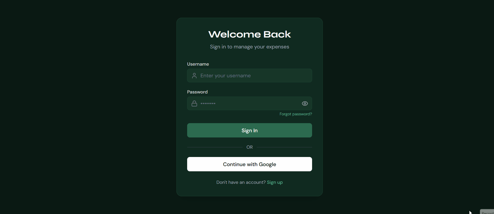

# 💸 Expense Tracker — Full Stack Finance Manager

> A full-stack personal finance management application to track expenses, incomes, budgets, and analytics — built with **Spring Boot + React + JWT + Google OAuth2**.


---

## 🌟 Overview

Expense Tracker is a secure and scalable full-stack application that helps users manage their finances by tracking expenses, incomes, and budgets with powerful analytics.

---

## ✨ Features

### 🔐 Authentication & Security

* JWT-based authentication
* Email & password login/signup
* Google OAuth2 login
* Stateless authentication (no session dependency)
* Role-based authorization (`USER`, `ADMIN`, `AUDITOR`)

---

### 💸 Expense & Income Management

* Add, update, delete expenses & incomes
* Category-based tracking
* Date & category filtering
* Receipt upload support
* Custom date selection

---

### 📊 Analytics Dashboard

* Weekly spending analysis
* Income vs Expense comparison
* Category-wise breakdown
* Interactive charts (Recharts)

---

### 📁 Budget Management

* Create and manage budgets
* Track usage and remaining balance
* Overspending indicators

---

### 👤 Profile Management

* Update profile (name)
* Change password
* Email change with verification
* Delete account
* Provider type display (EMAIL / GOOGLE)

---

## 🛠️ Tech Stack

### Backend

* Java + Spring Boot
* Spring Security
* JWT Authentication
* OAuth2 (Google)
* Spring Data JPA + Hibernate
* PostgreSQL
* Maven

---

### Frontend

* React (Vite)
* Tailwind CSS
* Axios (with interceptor)
* Recharts
* Context API

---

## ⚙️ Architecture

* Stateless JWT authentication
* OAuth2 login → JWT → frontend handling
* Layered backend:

  * Controller → Service → Repository
* Role-based permission mapping

---

## 🔑 Authentication Flow

### Email Login

1. User logs in with credentials
2. Backend validates and returns JWT
3. Frontend stores token
4. Token attached to all API requests

---

### Google OAuth Login

1. User logs in via Google
2. Backend authenticates OAuth user
3. Existing user reused via email
4. JWT token generated
5. Redirect to frontend with token

---

## 📡 API Highlights

### User

* `GET /api/users/profile`
* `PUT /api/users/profile`
* `PUT /api/users/change-password`
* `DELETE /api/users/delete`

### Expense

* `POST /api/expenses`
* `GET /api/expenses`
* `PUT /api/expenses/{id}`
* `DELETE /api/expenses/{id}`

### Analytics

* `GET /api/analytics/weekly`
* `GET /api/analytics/income-expense`

---

## 🧪 Key Challenges Solved

* Fixed OAuth redirect loop issues
* Resolved JWT vs OAuth session conflicts
* Implemented stateless authentication
* Fixed LocalDateTime parsing issues
* Debugged role-based authorization failures
* Ensured consistent user identity across login methods
* Fixed analytics data mapping (weekly + charts)

---

## 📸 Screenshots

### 🏠 Dashboard
<p align="center">
  
</p>

### 💸 Expenses
<p align="center">
  
</p>

### 💰 Incomes
<p align="center">
  
</p>

### 📊 Analytics
<p align="center">
  
</p>

### 📁 Budgets
<p align="center">
  
</p>

### 🗂️ Categories
<p align="center">
  
</p>

### 👤 Profile
<p align="center">
  
</p>

### 🔐 Login
<p align="center">
  
</p>


## 🎥 Demo

<p align="center">
  
</p>

---

## 🚀 Getting Started

### Backend

```bash
cd backend
mvn clean install
mvn spring-boot:run
```

---

### Frontend

```bash
cd frontend
npm install
npm run dev
```

---

## ⚙️ Configuration

```properties
spring.datasource.url=jdbc:postgresql://localhost:5432/expense_tracker
spring.datasource.username=your_username
spring.datasource.password=your_password

spring.jpa.hibernate.ddl-auto=update

spring.security.oauth2.client.registration.google.client-id=YOUR_CLIENT_ID
spring.security.oauth2.client.registration.google.client-secret=YOUR_CLIENT_SECRET
```

---

## 🚀 Future Improvements

* Account linking (EMAIL + GOOGLE)
* Notifications & reminders
* Mobile responsiveness improvements

---

## 👨‍💻 Author

**Alok Raj**

---

## ⭐ Support

If you like this project, give it a ⭐ on GitHub!

